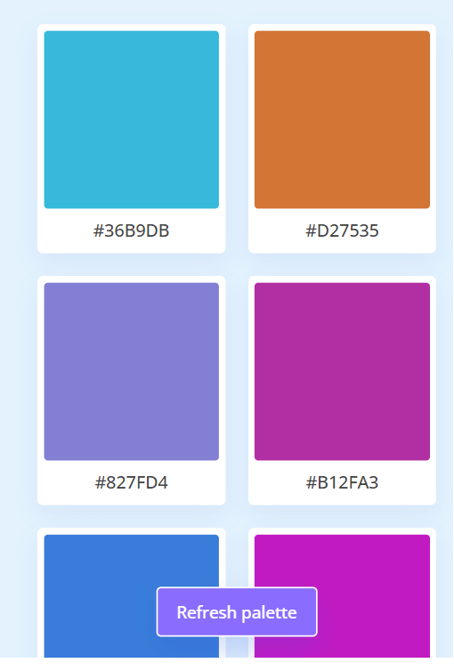
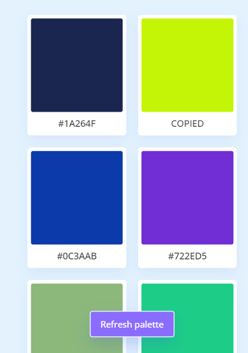

# Create A Random Color Palette Generator

## [Demo](https://bluewhale1202.github.io/JS-practice--Color-Palette-Generator/)

## Feature

1. Tạo random các bảng màu
2. Ta có thể nhấn đúp chuột vào để copy

## What I Learned from this Project?

-   CSS **:active** selector kết hợp với transform và transition để tạo hiệu ứng khi người dùng click chuột vào bảng màu để copy mã màu
-   **Navigator.clipboard** của Clipboard API có thể dùng để đọc hoặc ghi dữ liệu vào bộ nhớ đệm

## Note

-   CSS :active phải đặt sau :hover mới có tác dụng
-   Có một cách nữa là dùng document.execCommand('copy') nhưng nó ko còn dùng nữa [Document.execCommand()](https://developer.mozilla.org/en-US/docs/Web/API/Document/execCommand)
